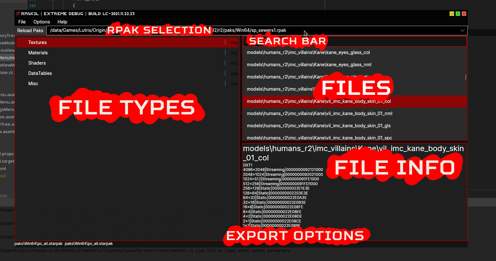
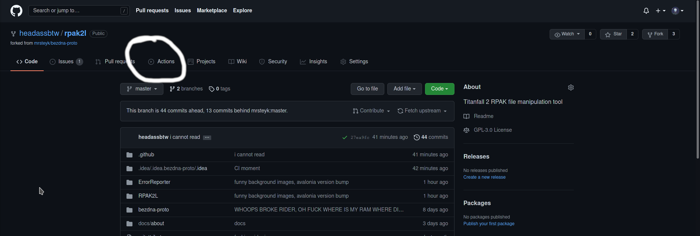
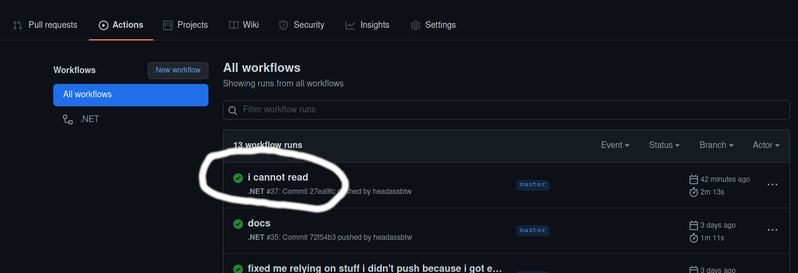
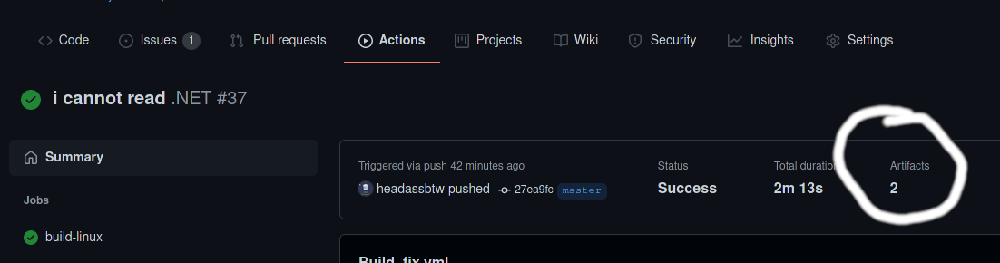
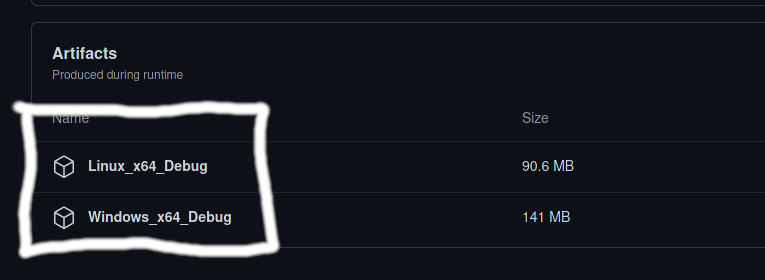

# bezdna-proto (+ RPAK2L GUI)

i forked this repo, not only to preserve the code, but also to add a GUI to the program, since a half decent rpak GUI does not exist yet (looking at you, legion...)

## Quick Overview:

# Instructions:
1. Go to Options > Settings, and set your game/export paths, then hit the apply button (the tool may need a restart after this)
2. Click the "reload paks" button
3. Select an rpak from the dropdown next to the button
4. Wait for the files to load in
5. Select a file type from the left
6. Select a file from the right
7. Do what you want with the action buttons on the bottom right

## Running CI (GitHub Actions) Builds
If there isn't something in the releases tab, GitHub actions has your back, which automatically produces builds when i commit something
<h3>Steps:</h3>
1. Go to the "Actions" tab

2. Select the latest run

3. Select artifacts section

4. Download the artifact corresponding to your OS (Linux builds are currently the most stable, as it's what I use, windows builds are very iffy)

